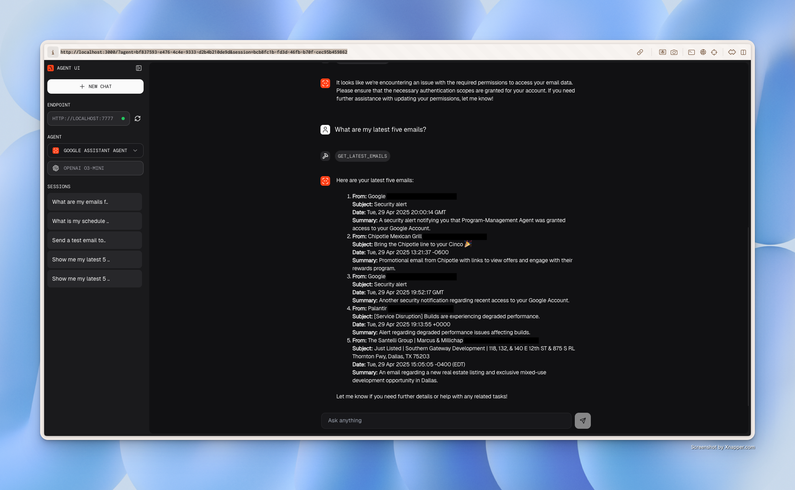

# Program Management Agent

This project implements a team of AI agents using the [Agno framework](https://docs.agno.com/) designed to assist with program management tasks. It leverages Google Calendar, Gmail, meeting scheduling tools, and web research capabilities.

## Demo

Watch a demonstration of the agent team in action:

[](https://youtu.be/zXtCTlUYRMY)

[Link to Demo Video on YouTube](https://youtu.be/zXtCTlUYRMY)

**Example Interaction Screenshot:**



## Features

*   **Google Integration:** Manages Google Calendar events and Gmail messages.
*   **Research:** Performs web searches to gather information.
*   **Meeting Coordination:** Schedules meetings (including Zoom) based on availability and context.
*   **Team Collaboration:** Uses Agno's team features to orchestrate tasks between specialized agents.
*   **Web UI:** A Next.js frontend (`agent-ui`) provides an interface to interact with the agents via the Agno Playground backend.

## Architecture

*   **Backend (Python):**
    *   Built with [Agno](https://docs.agno.com/).
    *   Defines individual agents (`google_agent`, `meeting_agent`, `research_agent`) in the `agents/` directory.
    *   Combines agents into a collaborative `program_team` in the `team/` directory.
    *   Uses `playground-app/playground.py` to serve the agents and team via the Agno Playground API (default: `http://localhost:7777`).
    *   Requires Python 3.10+.
*   **Frontend (Node.js / Next.js):**
    *   Located in the `agent-ui/` directory.
    *   Provides a chat interface to interact with the backend.
    *   Requires Node.js and `pnpm`.

## Setup

### 1. Clone the Repository

```bash
git clone https://github.com/IntelIP/Program-Management-Agent
cd Program-Management-Agent
```

### 2. Backend Setup (Python)

*   **Create Virtual Environment:**
    ```bash
    python3 -m venv .venv
    source .venv/bin/activate # On Windows use `.venv\Scripts\activate`
    ```
*   **Install Dependencies:**
    ```bash
    pip install -r requirements.txt
    ```
*   **Environment Variables:**
    *   Create a `.env` file in the root directory.
    *   Add your OpenAI API key:
        ```
        OPENAI_API_KEY=sk-...
        ```
    *   _(Optional)_ Add other keys if needed by specific tools (e.g., `EXA_API_KEY` if using ExaTools).
*   **Google Cloud Credentials:**
    *   You need Google Cloud OAuth 2.0 Client ID credentials.
    *   Follow the Google Cloud instructions to [create OAuth client ID credentials](https://developers.google.com/workspace/guides/create-credentials#oauth-client-id).
    *   Download the credentials JSON file.
    *   **IMPORTANT:** Place this file in a secure location **outside** the project directory. **Do not commit this file to Git.**
    *   Set the following environment variables in your `.env` file, pointing to your downloaded credentials file:
        ```
        GOOGLE_CREDENTIALS_PATH=/path/to/your/downloaded/credentials.json
        # Optional: Specify where the token should be saved (defaults to agents/token.json)
        # GOOGLE_TOKEN_PATH=./secrets/token.json 
        ```

### 3. Frontend Setup (Node.js)

*   **Navigate to UI directory:**
    ```bash
    cd agent-ui
    ```
*   **Install Dependencies:**
    ```bash
    pnpm install
    ```
*   **Environment Variables (Optional):**
    *   If the frontend needs to know the backend URL (other than the default `http://localhost:7777`), create a `.env.local` file in the `agent-ui` directory:
        ```
        NEXT_PUBLIC_PLAYGROUND_ENDPOINT=http://your-backend-url:port
        ```

## Running the Application

### 1. Authenticate Google Services (One-time or if token expires/scopes change)

Due to how Google OAuth scopes are requested by the underlying libraries, you need to run a helper script the *first* time or whenever you need to re-authenticate with potentially new permissions (scopes):

```bash
python auth_google.py
```

*   This script will attempt to call both Calendar and Gmail functions.
*   It will print a Google Authorization URL in your terminal.
*   Copy this URL, paste it into your browser, log in to your Google Account, and **grant permissions for BOTH Google Calendar and Gmail** when prompted.
*   This will create a `token.json` file (location specified by `GOOGLE_TOKEN_PATH` environment variable, or `agents/token.json` by default). **Ensure this token path is included in your `.gitignore`!**

### 2. Start the Backend Server

Make sure your Python virtual environment is activated (`source .venv/bin/activate`).

```bash
python playground-app/playground.py
```

The backend API will be running (usually at `http://localhost:7777`).

### 3. Start the Frontend UI

In a **separate terminal**, navigate to the `agent-ui` directory.

```bash
cd agent-ui
pnpm dev
```

The frontend will be running (usually at `http://localhost:3000`). Open this URL in your browser.

## Usage

*   Open the frontend URL (e.g., `http://localhost:3000`) in your browser.
*   Select the 'Program Team' from the available agents/teams.
*   Enter prompts to interact with the team (e.g., "Summarize my emails from today and schedule a follow-up meeting").

## Contributing

Please see `CONTRIBUTING.md` for details.

## License

This project is licensed under the MIT License - see the `LICENSE` file for details. 